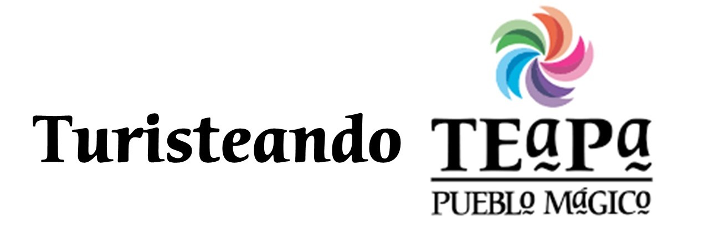

# Turisteando Teapa 

Turisteando Teapa, es una aplicación web diseñada para ofrecer una experiencia completa y accesible para los visitantes. Esta plataforma permite a los usuarios explorar los principales atractivos turísticos, como balnearios, restaurantes, hoteles y otros sitios destacados en Teapa, Tabasco. Además, facilita la planificación del viaje al permitir realizar reservaciones de hospedaje en tiempo real.

**Con nuestra aplicación web podrás:**

- Explorar los balnearios.
- Encontrar lugares para comer.
- Hacer reservaciones de hoteles.
- Descubrir los lugares más visitados.

**Tecnologías:**

- Laravel
- Tailwind CSS

**Equipo:**

José Alberto Martínez Vázquez.
Isabel Reyes Morfinez.
José Enrique Suarez Salas.
Jesús Miguel Olan Rosado.
